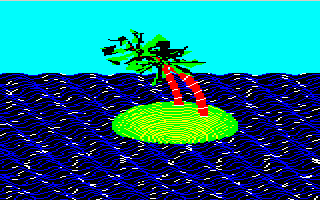
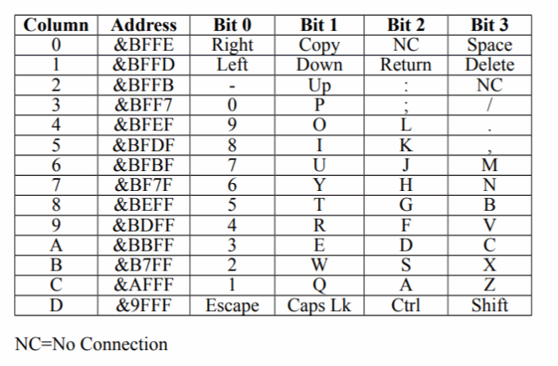
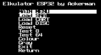
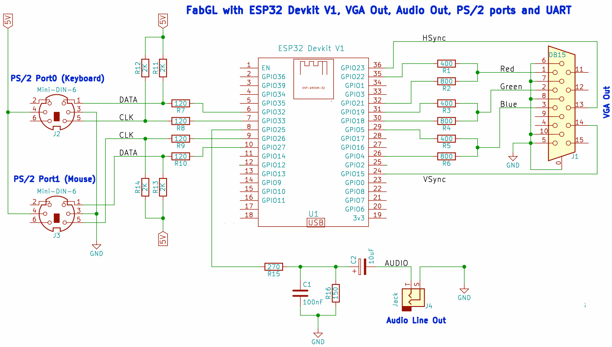

# ESP32 Tiny Elkulator
Port x86 Elkulator Acorn Electron version 0.5 (author Tom Walker) to TTGO VGA32 v1.x (1.0, 1.1, 1.2, 1.4) board with ESP32.

 
I have made several modifications:
<ul>
 <li>Running on ESP32 with 520 KB of RAM (TTGO VGA32)</li>
 <li>Use of a single core</li>
 <li>Low-income OSD</li>
 <li>Created project compatible with Arduino IDE and Platform IO</li>
 <li>Web Editor and ArduinoDroid (6.3.1) compatible project with tool makeandroid.bat</li>
 <li>Loading ROMs in Flash progmem</li>
 <li>Loading SNA (version 0.5) in Flash progmem</li>
 <li>Loading ADF disk in Flash progmem</li>
 <li>8 and 64 color mode support (reduced version by Ricardo Massaro)</li>
 <li>Video mode 320x200</li>
 <li>Screen scale</li>
 <li>Precompiled version (flash download 3.9.2) 320x200 (DAC 3 bits, 8 colors)</li>
 <li>No sound emulation for the time being.</li>
 <li>Option to remove the IEEE (double) rounding calculation from the VGA, to avoid accuracy issues. This anomaly was found as a result of David Crespo Tascón's failure to take video.</li>
 <li>
   There are no keys to be mapped:
   

   <pre>
    Missing:
    Row 0: Copy (bit 1) and NC (bit 2, No connection, no need)
    Row 2: NC (bit 3, No connection, no need)
    Row 3: ; (bit 2)    
   </pre>  
 </li> 
</ul>

  
<h1>Precompiled version</h1>
In the precompile folder there is a version already compiled to be saved with the flash download tool 3.9.2. It is a version with 320x200 resolution (DAC 3 bits, 8 colors) with the demo games in FLASH.  
<a href='https://github.com/rpsubc8/ESP32TinyElkulator/tree/main/esp32/precompile/320x200'>https://github.com/rpsubc8/ESP32TinyElkulator/tree/main/esp32/precompile/320x200</a>
 
A 320x200 option without IEEE calculation has also been added.
  
We must choose the ESP32 type:

Subsequently, select the files as shown in the attached screenshot, with the same offset values:

And we will press start. If everything has been correct, we will only have to restart the ESP32.

  
<h1>Requirements</h1>
Required:
 <ul>
  <li>TTGO VGA32 v1.x (1.0, 1.1, 1.2, 1.4)</li>
  <li>Visual Studio 1.66.1 PLATFORMIO 2.5.0 Espressif32 v3.5.0</li>
  <li>Arduino IDE 1.8.11 Espressif System 1.0.6</li>
  <li>ArduinoDroid (6.3.1)</li>
  <li>Arduino bitluni 0.3.3 reduced library (included in project)</li>
 </ul>

  
<h1>ArduinoDroid</h1>
You must run, just once, the script makeandroid.bat, which leaves the entire data structure of the dataFlash directory in the root directory, as well as replacing the main files with .h calls without using the dataFlash data directory. 
At the end, the script itself ends up deleting the dataFlash directory. 
The script uses fart.exe (find and replace text). 
Once, it has been successfully executed, it can be used with the ArduinoDroid.

  
<h1>Arduino Web Editor</h1>
The makeandroid.bat script must be run once only. Once finished, it is uploaded to the cloud as any other project, either compressed in zip or by files.

  
<h1>PlatformIO</h1>
PLATFORMIO 2.5.0 must be installed from the Visual Studio extensions. Espressif32 v3.5.0 is also required. 

Then the working directory <b>TinyElkulatorttgovga32</b> will be selected.
We must modify the file <b>platformio.ini</b> the option <b>upload_port</b> to select the COM port where we have our TTGO VGA32 board.

Then we will proceed to compile and upload to the board. No partitions are used, so we must upload all the compiled binary.
Everything is prepared so we don't have to install the bitluni libraries.

  
<h1>Arduino IDE</h1>
The whole project is compatible with the structure of Arduino 1.8.11.
We only have to open the <b>elkulator.ino</b> of the <b>elkulator</b> directory.

We must install the spressif (v1.0.6) extensions in the additional card url manager <b>https://dl.espressif.com/dl/package_esp32_index.json</b>
For the normal mode, the project is already prepared, so that no bitluni library is needed.
We can do it from the library manager.
We must deactivate the PSRAM option, and in case of exceeding 1 MB of binary, select 4 MB of partition when uploading. Although the code does not use PSRAM, if the option is active and our ESP32 does not have it, an exception will be generated and it will be restarted in loop mode.

  
<h1>Usability</h1>
Loading is allowed:
 <ul>
  <li>Snapshots SNA (version 0.5)</li>    
  <li>16 KB and 32 KB cartridges</li>
  <li>ADF format discs</li> 
 </ul>
 There is a basic OSD of low resources, that is to say, very simple, that is visualized by pressing the key <b>F1</b>.
 

  
 The files must be converted to .h in hexadecimal. You can use the online tool: 
 <a href='http://tomeko.net/online_tools/file_to_hex.php?lang=en'>http://tomeko.net/online_tools/file_to_hex.php?lang=en</a>

  
<h1>Options</h1>
The file <b>gbConfig.h</b> options are selected:
<ul>   
 <li><b>use_lib_vga320x200:</b> 320x200 mode</li>
 <li><b>use_lib_320x200:</b> Displays 200 lines in, instead of 256 in 320x200</li>
 <li><b>use_lib_vga8colors:</b> 8-color (3-bit RGB) or 64-color (6-bit RRGGBB) mode</li>
 <li><b>use_lib_log_serial:</b> Logs are sent by serial port usb</li>
 <li><b>FIX_PERIBOARD_NOT_INITING:</b> David Crespo Tascón's solution for keyboards that do not initialize.</li>
 <li><b>gb_ms_keyboard:</b> You must specify the number of milliseconds of polling for the keyboard.</li>
 <li><b>use_lib_fix_double_precision:</b> It doesn't use the VGA video frequency calculation with the ESP32 itself, avoiding possible accuracy problems with the mantissa. This is useful for ESP32's that miscalculate the frequency.</li>
</ul>

  
<h1>Test applications</h1>
Multiple games have been left in SNA format (version 0.5):
<ul>
 <li>Craze Erider</li>
 <li>Space Invaders</li>
 <li>Killer gorilla</li>
 <li>Stock car</li>
 <li>Felix</li>
</ul>

Multiple cartridges (16 KB) have been left behind:
<ul>
 <li>Hopper</li>
 <li>Snapper</li>
</ul>

Multiple cartridges (32 KB) have been left behind:
<ul>
 <li>Count Down</li>
 <li>Star Ship Command</li>
 <li>LISP</li>
</ul>

The Wellcome disc has been left behind. For testing from the emulator:
<pre>
 *CAT
 *!BOOT
</pre>

  
<h1>DIY circuit</h1>
If we don't want to use a TTGO VGA32 v1.x board, we can build it following fabgl's schematic:

