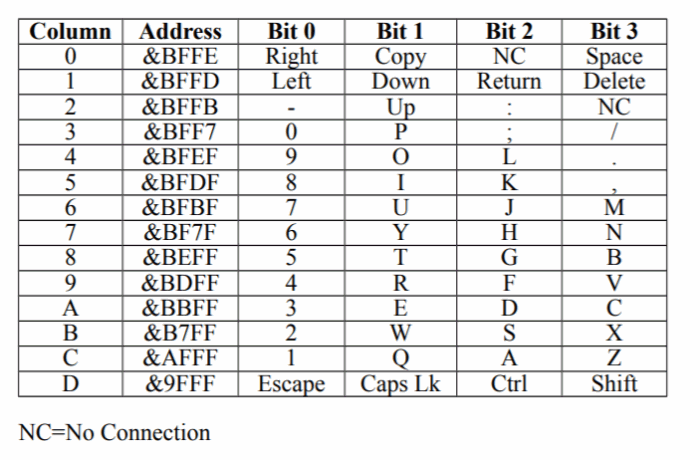
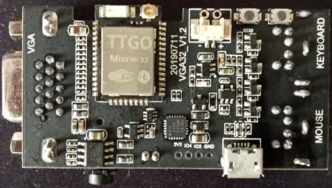
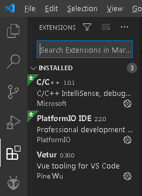
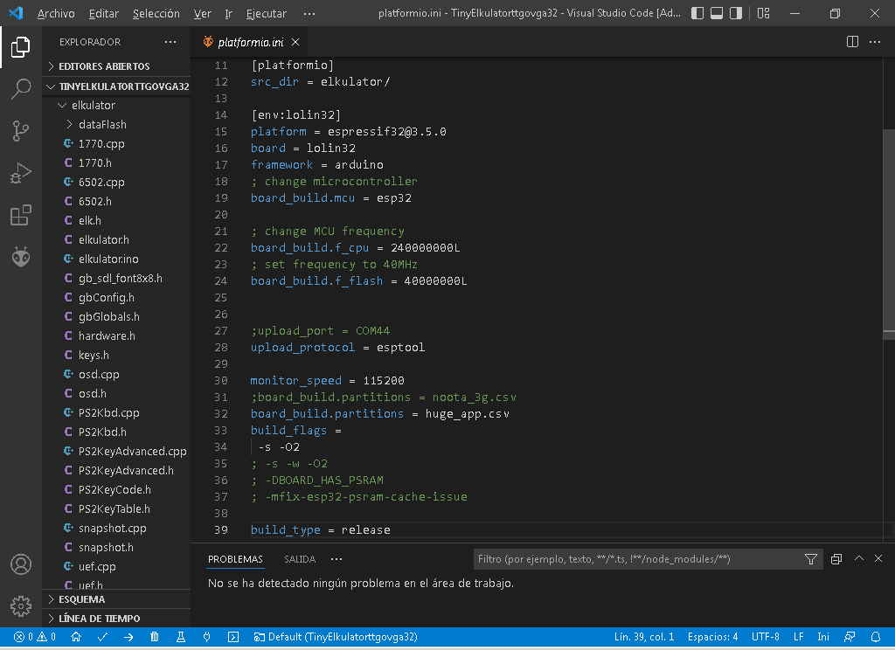
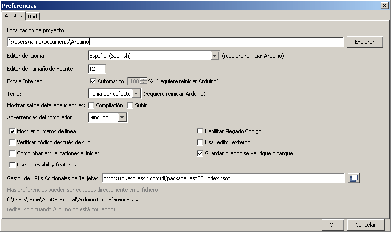
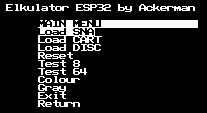

# ESP32 Tiny Elkulator
Port del emulador x86 Elkulator Acorn Electron versión 0.5 (autor Tom Walker) a la placa TTGO VGA32 v1.x (1.0, 1.1, 1.2, 1.4) con ESP32.

 
He realizado varias modificaciones:.
<ul>
 <li>Funciona en ESP32 con 520 KB de RAM (TTGO VGA32)</li>
 <li>Usa un sólo core</li>
 <li>OSD de bajos recursos</li>
 <li>Proyecto compatible con Arduino IDE y Platform IO</li>
 <li>Carga de ROMs desde Flash progmem</li>
 <li>Carga de SNA (version 0.5) desde Flash progmem</li>
 <li>Carga de discos ADF disk desde Flash progmem</li>
 <li>Soporta 8 y 64 colores (librería reducida de Ricardo Massaro)</li>
 <li>Modo de video 320x200</li>
 <li>Permite escala de pantalla en 320x200. Recordar que el acorn tiene 256 lineas.</li>
 <li>Versión precompilada (flash download 3.9.2) 320x200 (DAC 3 bits, 8 colores)</li>
 <li>Sin emulación de sonido, por ahora.</li>
 <li>
   Faltan teclas por mapear:
   

   <pre>
    Faltan:
    Fila 0: Copy (bit 1) y NC (bit 2, Sin conexión, no se necesita)
    Fila 2: NC (bit 3, Sin conexión, no se necesita)
    Fila 3: ; (bit 2)    
   </pre>  
 </li>
</ul>

  
<h1>Versión precompilada</h1>
  En la carpeta <b>precompile</b> hay una versión ya compilada para ser guardada con la herramienta de descarga flash 3.9.2. Es una versión con resolución 320x200 (DAC 3 bits, 8 colores) con los juegos de demostración en FLASH.  
<a href='https://github.com/rpsubc8/ESP32TinyElkulator/tree/main/esp32/precompile/320x200'>https://github.com/rpsubc8/ESP32TinyElkulator/tree/main/esp32/precompile/320x200</a>
  
Debemos elegir el tipo ESP32:

A continuación, seleccione los archivos como se muestra en la captura de pantalla adjunta, con los mismos valores de desplazamiento:

Y pulsaremos start. Si todo ha sido correcto, solo tendremos que reiniciar el ESP32.

  
<h1>Requerimientos</h1>
Se requiere:
 <ul>
  <li>TTGO VGA32 v1.x (1.0, 1.1, 1.2, 1.4)</li>
  <li>Visual Studio 1.66.1 PLATFORMIO 2.5.0 Espressif32 v3.5.0</li>
  <li>Arduino IDE 1.8.11 Espressif System 1.0.6</li>
  <li>Librería reducida Arduino bitluni 0.3.3 (incluida en proyecto)</li>  
 </ul>

  
<h1>PlatformIO</h1>
Se debe instalar el PLATFORMIO 2.5.0 desde las extensiones del Visual Studio. Se requiere también Espressif32 v3.5.0. 

Luego se seleccionará el directorio de trabajo <b>TinyElkulatorttgovga32</b>.
Debemos modificar el fichero <b>platformio.ini</b> la opción <b>upload_port</b> para seleccionar el puerto COM donde tenemos nuestra placa TTGO VGA32.

Luego procederemos a compilar y subir a la placa. No se usa particiones, así que debemos subir todo el binario compilado.
Está todo preparado para no tener que instalar las librerias de bitluni.

  
<h1>Arduino IDE</h1>
Todo el proyecto es compatible con la estructura de Arduino 1.8.11.
Tan sólo tenemos que abrir el <b>elkulator.ino</b> del directorio <b>elkulator</b>.

Debemos instalar las extensiones de spressif (v1.0.6) en el gestor de urls adicionales de tarjetas <b>https://dl.espressif.com/dl/package_esp32_index.json</b>
Para el modo normal, ya está preparado el proyecto, de forma que no se necesita ninguna librería de bitluni.
Lo podemos hacer desde el administrador de bibliotecas.
Debemos desactivar la opción de PSRAM, y en caso de superar 1 MB de binario, seleccionar 4 MB de partición a la hora de subir. Aunque el código no use PSRAM, si la opción está activa y nuestro ESP32 no dispone de ella, se generará una excepción y reinicio del mismo en modo bucle.

  
<h1>Usabilidad</h1>
Se permite cargar:
 <ul>
  <li>Snapshots SNA (version 0.5)</li> 
  <li>Cartuchos 16 KB y 32 KB</li>
  <li>Discos formato ADF</li>
 </ul>
 Se dispone de un OSD básico de bajos recursos, es decir, muy simple, que se visualiza pulsando la tecla <b>F1</b>.
 

 Los ficheros deben ser convertidos a .h en hexadecimal. Puede usarse la herramienta online: 
 <a href='http://tomeko.net/online_tools/file_to_hex.php?lang=en'>http://tomeko.net/online_tools/file_to_hex.php?lang=en</a>

  
<h1>Opciones</h1>
El archivo <b>gbConfig.h</b> se seleccionan las opciones:
<ul>  
 <li><b>use_lib_320x200:</b> Modo 320x200</li>
 <li><b>use_lib_vga8colors:</b> Modo 8 colores (3 bits RGB) o 64 colores (6 bits RRGGBB)</li>
 <li><b>use_lib_log_serial:</b> Se envian logs por puerto serie usb</li>
 <li><b>FIX_PERIBOARD_NOT_INITING:</b> Solución de David Crespo Tascón para teclados que no se inicializan.</li>
 <li><b>gb_ms_keyboard:</b> Se debe especificar el número de milisegundos de polling para el teclado.</li> 
</ul>

  
<h1>Aplicaciones Test</h1>
Se han dejado múltiples juegos en formato SNA (versión 0.5):
<ul>
 <li>Craze Erider</li>
 <li>Space Invaders</li>
 <li>Killer gorilla</li>
 <li>Stock car</li>
 <li>Felix</li> 
</ul>

Se han dejado múltiples cartuchos (16 KB):
<ul>
 <li>Hopper</li>
 <li>Snapper</li>
</ul>

Se han dejado múltiples cartuchos (32 KB):
<ul>
 <li>Count Down</li>
 <li>Star Ship Command</li>
 <li>LISP</li> 
</ul>

Se ha dejado el disco de Wellcome. Para testear desde el emulador:
<pre>
 *CAT
 *!BOOT
</pre>

  
<h1>DIY circuito</h1>
Si no queremos usar una placa TTGO VGA32 v1.x, podemos construirla siguiendo el esquema de <b>fabgl</b>:

