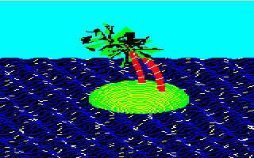
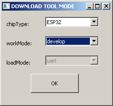
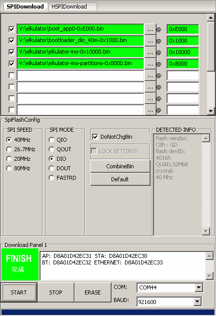

# ESP32 Tiny Elkulator
Port del emulador x86 Elkulator Acorn Electron versión 0.5 (autor Tom Walker) a la placa TTGO VGA32 v1.x (1.0, 1.1, 1.2, 1.4) con ESP32.

 
He realizado varias modificaciones:.
<ul>
 <li>Funciona en ESP32 con 520 KB de RAM (TTGO VGA32)</li>
 <li>Usa un sólo core</li>
 <li>OSD de bajos recursos</li>
 <li>Proyecto compatible con Arduino IDE y Platform IO</li>
 <li>Caraga de ROMs desde Flash progmem</li>
 <li>Carga de SNA (version 0.5) desde Flash progmem</li>
 <li>Carga de discos ADF disk desde Flash progmem</li>
 <li>Soporta 8 y 64 colores (librería reducida de Ricardo Massaro)</li>
 <li>Modo de video 320x200</li>
 <li>Permite escala de pantalla en 320x200. Recordar que el acorn tiene 256 lineas.</li>
 <li>Versión precompilada (flash download 3.9.2) 320x200 (DAC 3 bits, 8 colores)</li>
 <li>Sin emulación de sonido, por ahora.</li>
</ul>

  
<h1>Versión precompilada</h1>
  En la carpeta <b>precompile</b> hay una versión ya compilada para ser guardada con la herramienta de descarga flash 3.9.2. Es una versión con resolución 320x200 (DAC 3 bits, 8 colores) con los juegos de demostración en FLASH.  
<a href='https://github.com/rpsubc8/ESP32TinyElkulator/tree/main/esp32/precompile/320x200'>https://github.com/rpsubc8/ESP32TinyElkulator/tree/main/esp32/precompile/320x200</a>
  
Debemos elegir el tipo ESP32:

A continuación, seleccione los archivos como se muestra en la captura de pantalla adjunta, con los mismos valores de desplazamiento:

Y pulsaremos start. Si todo ha sido correcto, solo tendremos que reiniciar el ESP32.
